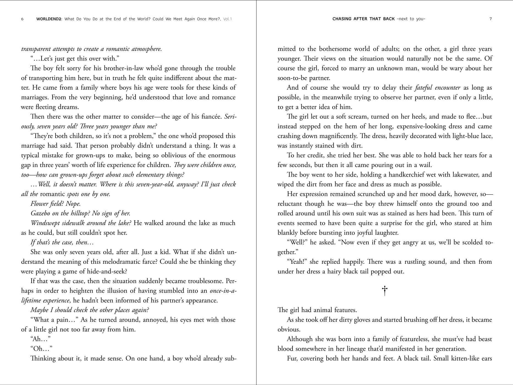
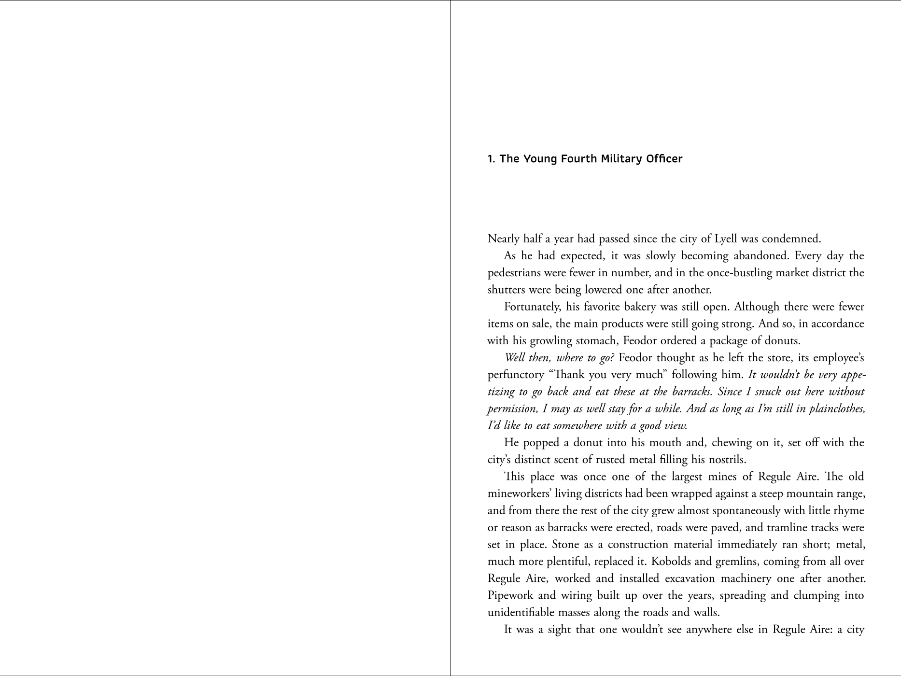
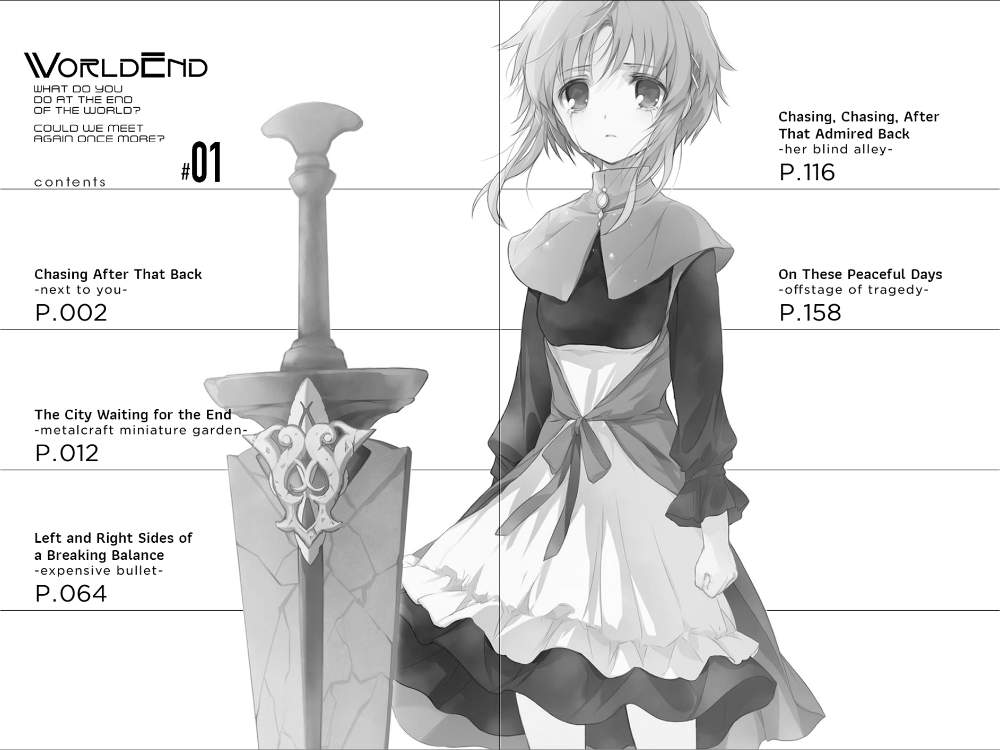
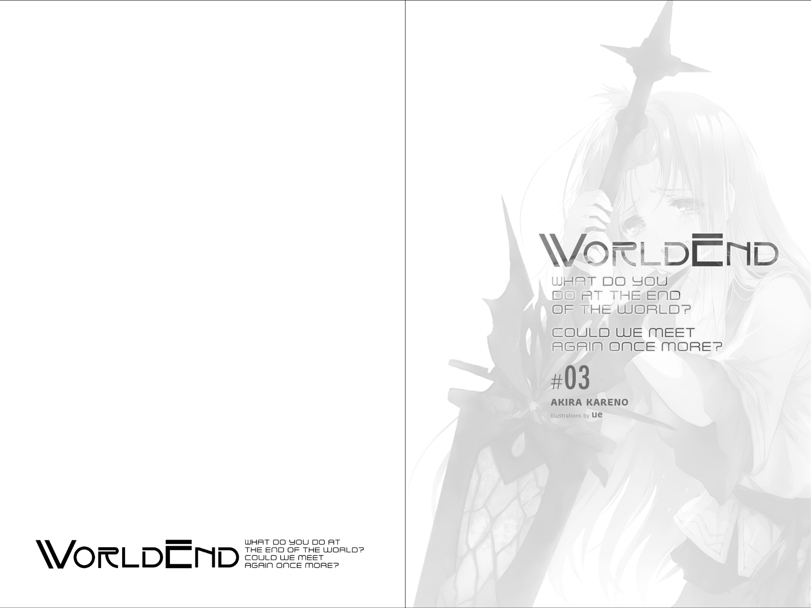
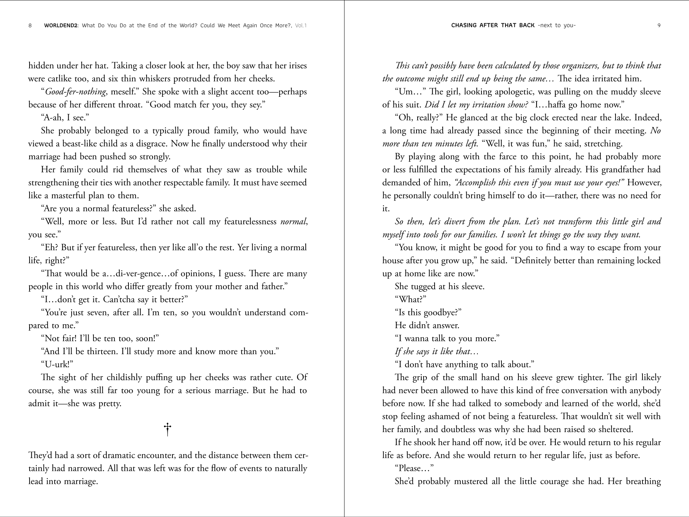

[](https://github.com/psf/black)

**Note:** Still very much a work-in-progress.

# Prerequisites
You should have the following:

1. Python packages listed in `requirements.txt`.
2. (If exporting to PDF) `xelatex` in your PATH.
    * If your TeX distribution does not support automatically installing missing packages, you'll also need to install all the necessary TeX packages to compile `Common/TeX/WorldEnd2_Common.tex`.

# Usage
## Exporting to PDF
Once you have completed all the prerequisites, you can run `Scripts/output_tex.py`:

```sh
python ./Scripts/output_tex.py "./Volumes/Volume_03/" "./Output_v03/"
```

- The first argument (`"./Volumes/Volume_03/"`) specifies the path to the directory containing the volume.
- The second argument (`"./Output_v03/"`) is the location for the output file and any temporary working files.

### Printing
If you want to generate the PDF for printing in a perfect-bound book, there are three related flags:

- `-b` (`--bleed-size`): Specify the bleed size.
- `-g` (`--gutter-size`): Specify the gutter size.
- `-n` (`--no-cover`): Do not include cover.
 
By default, the bleed size is 0 in, gutter size is 0 in, and cover is included.

For convenience, `-p` (`--print-mode`) is provided, which is short for `-b 0.125in -g 0.15in -n`.

It is possible to tweak the print options alongside `--print-mode` by appending them after. For example, `-p -b 0in` enables print mode without bleed. If you put the print options before print mode, they will be overwritten, but other arguments can be put before without consequence.

## Exporting to EPUB
To export to EPUB, run `Scripts/output_epub.py`:

``` sh
python ./Scripts/output_epub.py "./Volumes/Volume_03/" "./Output_v03/"
```

- The first argument (`"./Volumes/Volume_03/"`) specifies the path to the directory containing the volume.
- The second argument (`"./Output_v03/"`) is the location for the output file and any temporary working files.

# Changes from Orlandri Translation
- Use Yen Press names
- Insert and chapter images are in English
- Minor edits to the text
- Follow the Yen Press format as closely as possible, including:
  - Indented paragraphs
  - Table of Contents (TOC)
  - PDF font matches that of physical volumes
  - Spacing matches Yen Press or differs by no more than 2 millimeters
  - No space after ellipses (…)
  - No space around em dashes (—)
  - Capitalization for stutters matches Yen Press (e.g., Wi-widow)
  - Contractions use closing apostrophes (e.g., move on ’em)

# Screenshots
## PDF
**NOTE:** The actual PDF pages are singular; I just displayed them side-by-side.










### Including Gutter


## EPUB
<div align="center">
  
  
  
  
</div>

### Kindle
<div align="center">
  
  
  
  
</div>
